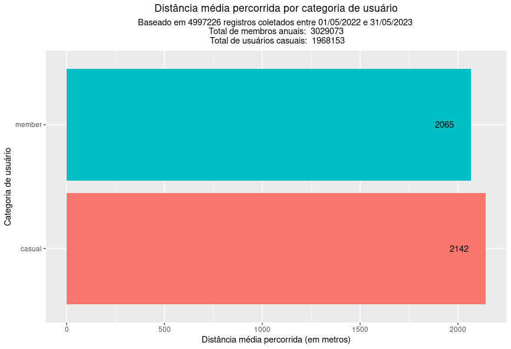

# Estudo de caso da Cyclistic

## Declaração da tarefa de negócios:
*O objetivo deste estudo de caso é analisar e identificar as diferenças no uso das bicicletas da Cyclistic entre os membros anuais e os ciclistas casuais. Através da análise dos dados históricos de trajetos de bicicleta, pretendemos obter insights sobre os padrões de utilização, preferências e comportamentos desses dois grupos de usuários. Esses insights serão fundamentais para desenvolver uma estratégia de marketing eficaz, visando a conversão de passageiros casuais em membros anuais. Ao compreender como os membros anuais e os ciclistas casuais utilizam as bicicletas de forma diferente, poderemos direcionar nossas ações de marketing de maneira mais precisa e personalizada, oferecendo benefícios e incentivos específicos para atrair e reter os passageiros casuais como membros anuais. O sucesso desse programa de marketing dependerá da análise abrangente dos dados e da apresentação de insights convincentes e visualizações de dados profissionais para a equipe executiva da Cyclistic.*
  
___
 

## Perguntas de orientação:
**1. Qual é o problema que você está tentando resolver?**

*Estamos buscando entender como os membros anuais e os ciclistas casuais utilizam as bicicletas da Cyclistic de forma diferente. Queremos identificar os padrões de uso, preferências e comportamentos desses dois grupos de usuários para desenvolver uma estratégia de marketing eficaz, visando a conversão de passageiros casuais em membros anuais.*
  

**2. Como seus insights podem nortear as decisões de negócios?**

*Os insights obtidos a partir da análise dos dados de uso das bicicletas podem fornecer informações valiosas para direcionar as ações de marketing da Cyclistic. Compreendendo as diferenças no uso das bicicletas entre membros anuais e ciclistas casuais, poderemos personalizar as estratégias de marketing, oferecendo benefícios e incentivos específicos para atrair e reter passageiros casuais como membros anuais. Essas decisões embasadas em dados têm o potencial de aumentar o número de membros anuais e impulsionar o crescimento da Cyclistic.*
  
___
 

## Principais tarefas:
**1. Identificar a tarefa de negócios:**

*Analisar e identificar as diferenças no uso das bicicletas da Cyclistic entre os membros anuais e os ciclistas casuais.*
  

**2. Considerar as principais partes interessadas:**

*Compreender as necessidades e expectativas da equipe executiva da Cyclistic, bem como as preferências e comportamentos dos membros anuais e ciclistas casuais, para orientar a tomada de decisões e desenvolver uma estratégia de marketing eficaz.*

  
___
 

## Considerações finais:

*Ao analisar os dados disponibilizados para este estudo de caso, foi possível perceber que membros anuais são a maioria dos registros, com cerca de 3 milhões de entradas, enquanto os usuários casuais correspondem a pouco menos de 2 milhões. Ainda, usuários casuais tendem a utilizar durante muito mais tempo as bicicletas do que os membros anuais - em média, quase o dobro do tempo:*

|  |

  

*Outrossim, a média da distância percorrida entre as duas categorias tem pouca diferença:*

|  |

*Portanto, o fator realmente relevante talvez seja o tempo médio que o usuário utiliza o serviço - e a abordagem para a assinatura de um plano anual pode ser nesse sentido: o custo médio por tempo de utilização.*
